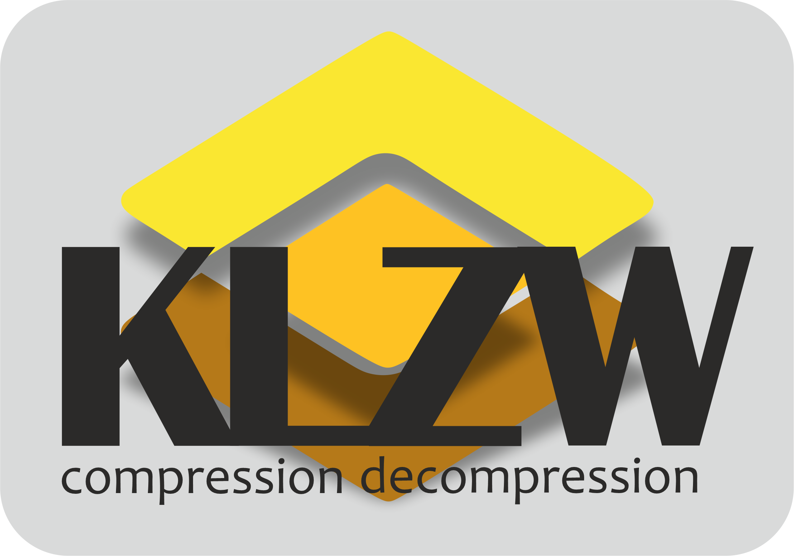

# Simple LZW Compressor (klzw)



This is my implementation of lzw compression heavily inspired by this article https://www.cs.cmu.edu/~cil/lzw.and.gif.txt

This is loseless compression and works best with text data.

## The stack 

- `gtest` for testing
- `cmake` for building
- `c++17` as main lang
    - `STL` standard template lib for basic stuff
    - `fstream` for file write and read

## Benchmark

Program | Filename | Size | Compressed Size | Data Compression Ratio
---| --- | --- | --- | ---
klzw (my program) | `bible.txt` | `4.3MB` | `1.4MB` | `3.07`
gzip | `bible.txt` | `4.3MB` | `1.4MB` | `3.07`
klzw (my program) | `LICENSE.txt` | `18KB` | `8.7KB` | `2.06`
gzip | `LICENSE.txt` | `18KB` | `6.7KB` | `2.68`
klzw (my program) | `sudo` (executable) | `198KB` | `116KB` | `1.70`
gzip | `sudo` (executable) | `198KB` | `88KB` | `2.25`

Please keep in mind that `klzw` is based on [LZW](https://www.geeksforgeeks.org/lzw-lempel-ziv-welch-compression-technique/) algorithm, and `gzip` is based on [DEFLATE](https://en.wikipedia.org/wiki/Deflate) algorithm

## How to compile

```
git clone 
cd lzw-compression
mkdir release
cd release 
cmake .. -DCMAKE_BUILD_TYPE=Release
make
./klzw
```

or if you on linux you can download latest build from releases 
https://github.com/mv-kan/lzw-compression/releases

## How to use

```
# compress
./klzw originfile

# decompress (output file has to have .klzw extension)
./klzw originfile.klzw

# compress but don't delete "originfile"
./klzw -k originfile

# decompress but add .copy to the end of "originfile"
# outputs to "originfile.copy"
./klzw -c originfile.klzw

# decompress but don't delete .klzw compressed file
./klzw -k originfile.klzw

# yes you can do that
./klzw -kc originfile.klzw
```

## Features 

- Compress files 
- Decompress files

## Biggest challenges durring implementation

1. Adding gtest. It is not easy and not intuitive at all. I have spend whole evening to understand how you can add gtest without cloning googletest repo to my repo. 
2. Writing arbitrary bits. So in summary LZW compression is about code size. And code size can be 9 bits, 10 bits, 13 bits. The biggest challenging part is to write 9 bits codes to file. Thus I need to pack 9 bits codes into 8 bits bytes and read bytes into 9 bits codes. It sounds not that difficult, but believe me it has its own pitfalls.  